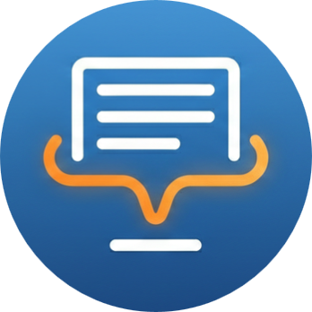

<h1 align="center">
  
  <br>
  AutoSummary
  <br>
</h1>

<h3 align="center">
An AI secretary for your server's meetings
</h3>

<p align="center">
AutoSummary is an AI-powered Discord bot that monitors messages and live meeting transcripts, provides real-time interval summaries, and generates a final participant evaluation using Gemini 3 Flash.
</p>

## ✨ Features

- **Interval Summaries:** Automatically collects messages every `n` minutes and posts a concise summary to a designated output channel.
- **Participant Evaluation:** When the session ends, the bot reads the entire meeting history and generates a performance review for each participant.
- **Slash Commands:** Fully controllable via modern Discord UI commands.

## 🛠️ Tech Stack

- **Language:** Python 3
- **Library:** `discord.py`
- **AI Integration:** OpenAI Python SDK (Connected to `yunwu.ai` API)
- **Model:** `gemini-3-flash-preview`
- **Hosting:** Discloud

## 💻 Commands

- `/start [output_channel]`: Starts a new monitoring session. The bot will begin collecting messages in the channel where the command was sent and push summaries to the `output_channel`.
- `/config [minutes] [prompt (optional)]`: Customizes the frequency of the summaries (default is 2 minutes) and the system prompt instructions.
- `/stop`: Ends the active session, flushes the remaining messages for a final interval summary, and generates the final participant evaluation.

## 🚀 Local Setup & Installation

If you want to run this bot locally on your machine or a GitHub Codespace:

1. **Clone the repository:**
   ```bash
   git clone https://github.com/YOUR_USERNAME/AutoSummary_Bot.git
   cd AutoSummary_Bot
   ```

2. **Install dependencies:**
   Make sure you have Python installed, then run:
   ```bash
   pip install -r requirements.txt
   ```

3. **Set up Environment Variables:**
   Create a `.env` file in the root directory and add your API keys:
   ```ini
   DISCORD_TOKEN=your_discord_bot_token_here
   YUNWU_API_KEY=your_yunwu_api_key_here
   ```

4. **Run the bot:**
   ```bash
   python autosummary.py
   ```

## ☁️ Deployment (Discloud)

This bot is configured to be easily deployed to **Discloud**. 
1. Ensure your `.env` file and `discloud.config` are present.
2. Use the Discloud VS Code extension to upload the workspace.
3. The bot relies on RAM to store active session history. *Note: If the bot restarts during a meeting, the current active session memory will be cleared.*

---
*Built by Ethan G*
